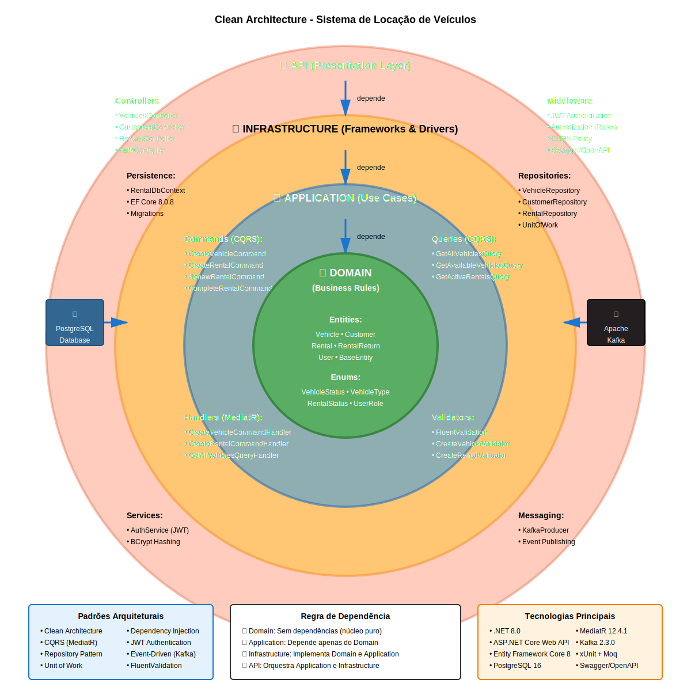
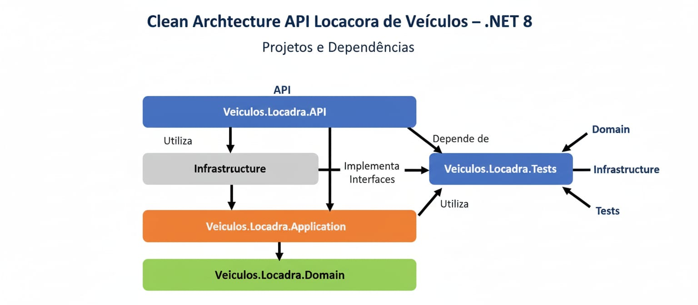

# Rental API - Sistema de Locação de Veículos


API RESTful robusta para gerenciamento de locadora de veículos. Sistema desenvolvido com foco em Clean Architecture, CQRS e boas práticas de desenvolvimento.

**[Funcionalidades](#funcionalidades)** • **[Tecnologias](#tecnologias)** • **[Instalação](#instalação)** • **[Uso](#uso)** • **[API](#documentação-da-api)** • **[Contribuir](#contribuindo)**

---

##  Índice

- [Sobre o Projeto](#sobre-o-projeto)
- [Funcionalidades](#funcionalidades)
- [Tecnologias](#tecnologias)
- [Arquitetura](#arquitetura)
- [Instalação](#instalação)
- [Uso](#uso)
- [Documentação da API](#documentação-da-api)
- [Testes](#testes)
- [Docker](#docker)
- [CI/CD](#cicd)
- [Contribuindo](#contribuindo)
- [Licença](#licença)

---

##  Sobre o Projeto

Rental API é uma aplicação completa para gerenciamento de locadoras de veículos, oferecendo um sistema robusto para controle de veículos, clientes e aluguéis. O projeto foi desenvolvido com foco em boas práticas de desenvolvimento, arquitetura limpa e escalabilidade.

### Principais Características

• **Clean Architecture** - Separação clara de responsabilidades (Domain, Application, Infrastructure, API)  
• **CQRS Pattern** - MediatR para Commands e Queries  
• **Repository Pattern** - Unit of Work para abstração de acesso a dados  
• **JWT Authentication** - Autorização baseada em roles (Admin, Atendente)  
• **Event-Driven** - Apache Kafka para mensageria assíncrona  
• **Code Quality** - FluentValidation, testes unitários e CI/CD  
• **Docker Ready** - Containerizado e pronto para deploy  
• **API Documentation** - Swagger/OpenAPI integrado

---

##  Funcionalidades

### Backend (API REST)

####  Autenticação

• Login com JWT  
• Controle de acesso baseado em roles (Admin, Atendente)  
• Proteção de rotas sensíveis  
• Hash de senhas com BCrypt

####  Veículos

• Criar, editar e listar veículos  
• Filtros por disponibilidade  
• Controle de status  
• Validação de dados

####  Clientes

• Cadastro completo de clientes  
• CRUD completo  
• Validação de CNH  
• Histórico de aluguéis

####  Aluguéis

• Criar aluguéis com validações de negócio  
• Renovar aluguéis ativos  
• Finalizar aluguéis com cálculo de valores  
• Listar aluguéis ativos  
• Publicação de eventos no Kafka:

- `rental.created` → Novo aluguel criado
- `rental.renewed` → Aluguel renovado
- `rental.completed` → Aluguel finalizado

####  Validações de Negócio

• Veículo deve estar disponível  
• Cliente deve estar ativo  
• Período de aluguel válido  
• Cálculo automático de valores  
• Soft delete preserva histórico

---

##  Tecnologias

### Backend

| Tecnologia            | Versão  | Descrição                   |
| --------------------- | ------- | --------------------------- |
| .NET                  | 8.0     | Framework principal         |
| ASP.NET Core          | 8.0     | API RESTful                 |
| Entity Framework Core | 8.0.8   | ORM e Code-First migrations |
| PostgreSQL            | 16      | Banco de dados relacional   |
| Apache Kafka          | Latest  | Message broker para eventos |
| MediatR               | 12.4.1  | CQRS implementation         |
| FluentValidation      | 11.10.0 | Validação de dados          |
| BCrypt.Net-Next       | 4.0.3   | Hash de senhas              |
| JWT                   | 8.0.2   | Autenticação e autorização  |
| Swagger/OpenAPI       | -       | Documentação da API         |

### Testes

| Tecnologia       | Descrição                      |
| ---------------- | ------------------------------ |
| xUnit            | Framework de testes unitários  |
| Moq              | Mocking para testes            |
| FluentAssertions | Assertions fluentes e legíveis |

### DevOps

• **Docker** - Containerização  
• **Docker Compose** - Orquestração de containers  
• **GitHub Actions** - CI/CD pipeline  
• **PostgreSQL** - Banco de dados  
• **Kafka + Zookeeper** - Mensageria

---

##  Arquitetura



_Diagrama circular da Clean Architecture mostrando as camadas: Domain (núcleo verde), Application (azul), Infrastructure (amarelo) e API (vermelho)_

### Estrutura de Diretórios

```plaintext
Dotnet8-Rental-API/
├── src/
│   ├── RentalAPI.Domain/          # Entidades, Enums, Interfaces
│   ├── RentalAPI.Application/     # DTOs, Commands, Queries, Handlers
│   ├── RentalAPI.Infrastructure/  # DbContext, Repositories, Kafka
│   └── RentalAPI.API/            # Controllers, Middleware
├── tests/
│   └── RentalAPI.Tests/          # Testes unitários
├── Dockerfile
├── docker-compose.yml
└── .github/workflows/
    └── build-and-test.yml
```

### Padrões Implementados

• **Clean Architecture** - Separação de camadas com dependências unidirecionais  
• **CQRS** - Separação de Commands e Queries usando MediatR  
• **Repository Pattern** - Abstração de acesso a dados  
• **Unit of Work** - Gerenciamento de transações  
• **Dependency Injection** - Inversão de controle  
• **Event-Driven** - Publicação de eventos no Kafka

### Banco de Dados - Modelo de Dados

```plaintext
┌─────────────┐       ┌─────────────┐       ┌─────────────┐
│   Vehicle   │       │   Rental    │       │  Customer   │
├─────────────┤       ├─────────────┤       ├─────────────┤
│ Id          │       │ Id          │       │ Id          │
│ Brand       │       │ CustomerId  │───────┤ Name        │
│ Model       │       │ VehicleId   │───┐   │ Email       │
│ Year        │◄──────┤ StartDate   │   │   │ Phone       │
│ LicensePlate│       │ EndDate     │   │   │ CNH         │
│ Category    │       │ TotalAmount │   │   │ Address     │
│ IsAvailable │       │ Status      │   │   │ IsActive    │
│ CreatedAt   │       │ CreatedAt   │   │   │ CreatedAt   │
│ UpdatedAt   │       │ UpdatedAt   │   │   │ UpdatedAt   │
└─────────────┘       └─────────────┘   │   └─────────────┘
                                        │
                      ┌─────────────┐   │   ┌─────────────┐
                      │RentalReturn │   │   │    User     │
                      ├─────────────┤   │   ├─────────────┤
                      │ Id          │   │   │ Id          │
                      │ RentalId    │───┘   │ Username    │
                      │ ReturnDate  │       │ Password    │
                      │ FinalAmount │       │ Role        │
                      │ Notes       │       │ IsActive    │
                      │ CreatedAt   │       │ CreatedAt   │
                      └─────────────┘       └─────────────┘
```

---

##  Instalação

### Pré-requisitos

• **Docker** - [Download](https://www.docker.com/products/docker-desktop)  
• **Docker Compose** - Incluído no Docker Desktop  
• **.NET 8 SDK** - [Download](https://dotnet.microsoft.com/download/dotnet/8.0) (opcional, para desenvolvimento local)

### Instalação com Docker (Recomendado)

#### 1. Clone o repositório

```bash
git clone https://github.com/nevesmarcos42/Dotnet8-Rental-API.git
cd Dotnet8-Rental-API
```

#### 2. Inicie a aplicação

```bash
docker-compose up -d
```

Pronto! A aplicação estará rodando em:

• **API**: `http://localhost:5000`  
• **Swagger UI**: `http://localhost:5000/swagger`  
• **PostgreSQL**: `localhost:5432`  
• **Kafka**: `localhost:9092`

#### 3. Verificar status dos containers

```bash
docker-compose ps
```

#### 4. Parar a aplicação

```bash
docker-compose down
```

### Instalação Local (Desenvolvimento)

#### 1. Clone o repositório

```bash
git clone https://github.com/nevesmarcos42/Dotnet8-Rental-API.git
cd Dotnet8-Rental-API
```

#### 2. Restore dependências

```bash
dotnet restore
```

#### 3. Configure a connection string

Edite `src/RentalAPI.API/appsettings.json` com suas credenciais PostgreSQL e Kafka.

#### 4. Execute as migrations

```bash
dotnet ef database update --project src/RentalAPI.Infrastructure --startup-project src/RentalAPI.API
```

#### 5. Execute a aplicação

```bash
dotnet run --project src/RentalAPI.API/RentalAPI.API.csproj
```

---

##  Uso

### Primeiro Acesso

1. **Acesse o Swagger UI**: `http://localhost:5000/swagger`
2. **Faça login** para obter um token JWT:
   - Use o endpoint `POST /api/auth/login`
   - Credenciais padrão (se seed data estiver configurado):
     - Admin: `admin@rental.com` / `Admin@123`
     - Atendente: `atendente@rental.com` / `Atendente@123`
3. **Autorize no Swagger**:
   - Clique no botão "Authorize"
   - Digite: `Bearer {seu-token-jwt}`
   - Agora você pode testar os endpoints protegidos

### Funcionalidades Principais

#### Gerenciar Veículos

```bash
# Como ADMIN
# 1. Listar todos os veículos
GET /api/vehicles

# 2. Criar novo veículo
POST /api/vehicles
{
  "brand": "Toyota",
  "model": "Corolla",
  "year": 2024,
  "licensePlate": "ABC-1234",
  "category": "Sedan",
  "dailyRate": 150.00
}

# 3. Atualizar veículo
PUT /api/vehicles/{id}

# 4. Deletar veículo
DELETE /api/vehicles/{id}
```

#### Criar Aluguéis

```bash
# Como ADMIN ou ATENDENTE
# 1. Criar novo aluguel
POST /api/rentals
{
  "customerId": "uuid-do-cliente",
  "vehicleId": "uuid-do-veiculo",
  "startDate": "2024-01-15",
  "endDate": "2024-01-20"
}

# 2. Renovar aluguel
PUT /api/rentals/{id}/renew
{
  "newEndDate": "2024-01-25"
}

# 3. Finalizar aluguel
PUT /api/rentals/{id}/complete
```

#### Visualizar Aluguéis Ativos

```bash
# Listar todos os aluguéis ativos
GET /api/rentals/active
```

---

##  Documentação da API

A documentação interativa está disponível via Swagger UI após iniciar a aplicação:

**URL**: `http://localhost:5000/swagger`

### Principais Endpoints

#### Autenticação JWT

```http
POST /api/auth/login
```

#### Veículos

```http
GET    /api/vehicles              # Listar (público)
GET    /api/vehicles/{id}         # Buscar por ID
GET    /api/vehicles/available    # Listar disponíveis
POST   /api/vehicles              # Criar (ADMIN)
PUT    /api/vehicles/{id}         # Atualizar (ADMIN)
DELETE /api/vehicles/{id}         # Deletar (ADMIN)
```

#### Clientes

```http
GET    /api/customers             # Listar
GET    /api/customers/{id}        # Buscar por ID
POST   /api/customers             # Criar
PUT    /api/customers/{id}        # Atualizar
DELETE /api/customers/{id}        # Deletar
```

#### Aluguéis

```http
GET    /api/rentals               # Listar
GET    /api/rentals/{id}          # Buscar por ID
GET    /api/rentals/active        # Listar ativos
POST   /api/rentals               # Criar (ADMIN/ATENDENTE)
PUT    /api/rentals/{id}/renew    # Renovar (ADMIN/ATENDENTE)
PUT    /api/rentals/{id}/complete # Finalizar (ADMIN/ATENDENTE)
```

### Exemplo de Requisição

#### Login

```bash
curl -X POST http://localhost:5000/api/auth/login \
  -H "Content-Type: application/json" \
  -d '{
    "email": "admin@rental.com",
    "password": "Admin@123"
  }'
```

#### Criar Veículo (com token)

```bash
curl -X POST http://localhost:5000/api/vehicles \
  -H "Content-Type: application/json" \
  -H "Authorization: Bearer SEU_TOKEN_JWT" \
  -d '{
    "brand": "Toyota",
    "model": "Corolla",
    "year": 2024,
    "licensePlate": "ABC-1234",
    "category": "Sedan",
    "dailyRate": 150.00
  }'
```

#### Criar Aluguel

```bash
curl -X POST http://localhost:5000/api/rentals \
  -H "Content-Type: application/json" \
  -H "Authorization: Bearer SEU_TOKEN_JWT" \
  -d '{
    "customerId": "uuid-do-cliente",
    "vehicleId": "uuid-do-veiculo",
    "startDate": "2024-01-15",
    "endDate": "2024-01-20"
  }'
```

---

##  Testes

### Executar Testes Unitários

O projeto possui testes unitários cobrindo as principais camadas da aplicação:

```bash
# Executar todos os testes
dotnet test

# Testes em modo watch
dotnet test --logger "console;verbosity=detailed"

# Ver relatório de cobertura
dotnet test --collect:"XPlat Code Coverage"
```

Cobertura de testes:

•  **Commands e Queries** (MediatR Handlers)  
•  **Validators** (FluentValidation)  
•  **Repositories** (EF Core)  
•  **Domain Entities**  
•  **Mocks** (Moq + FluentAssertions)

### Lint e Qualidade de Código

```bash
# Verificar formatação
dotnet format --verify-no-changes

# Aplicar formatação
dotnet format

# Build de produção (valida compilação)
dotnet build -c Release
```

---

##  Docker

### Arquitetura Docker

#### Containers

A aplicação é composta por 4 containers:

1. **rental-api** - ASP.NET Core API (.NET 8)
2. **postgres** - PostgreSQL 16
3. **kafka** - Apache Kafka (message broker)
4. **zookeeper** - Coordenação do Kafka

#### Volumes

• `postgres_data` - Persistência do banco de dados  
• `kafka_data` - Persistência do Kafka

#### Network

• `rental-network` - Comunicação entre containers

### Comandos Úteis

```bash
# Iniciar todos os serviços
docker-compose up -d

# Ver logs em tempo real
docker-compose logs -f

# Parar todos os serviços
docker-compose down

# Remover volumes (CUIDADO: apaga dados)
docker-compose down -v

# Rebuild da imagem da API
docker-compose build rental-api

# Executar apenas o banco de dados
docker-compose up -d postgres
```

---

##  CI/CD

O projeto inclui pipeline de CI/CD usando GitHub Actions.

### Workflow

```plaintext
Push/PR → Restore → Build → Tests → Docker Build
```

### Configuração

O arquivo `.github/workflows/build-and-test.yml` está configurado para:

•  Executar testes automaticamente  
•  Build do projeto .NET  
•  Validação de código  
•  Construir imagens Docker (branch main)

### Deploy

Para deploy em produção, adicione os secrets no GitHub:

```plaintext
DOCKER_USERNAME
DOCKER_PASSWORD
SERVER_HOST
SERVER_USER
SERVER_SSH_KEY
```

---

##  Regras de Negócio

### Veículos

• **Marca e modelo** são obrigatórios  
• **Placa** deve ser única  
• **Categoria** define o tipo do veículo  
• **Taxa diária** deve ser maior que zero  
• **Status** determina disponibilidade para aluguel

### Clientes

• **Email** único  
• **CNH** obrigatória e válida  
• **Telefone** para contato  
• Clientes inativos não podem fazer novos aluguéis

### Aluguéis

• **Veículo** deve estar disponível  
• **Cliente** deve estar ativo  
• **Data final** deve ser posterior à data inicial  
• **Cálculo automático** do valor total  
• **Eventos** são publicados no Kafka:

- `rental.created` → Criação de aluguel
- `rental.renewed` → Renovação de aluguel
- `rental.completed` → Finalização de aluguel

### Devoluções

• **Aluguel** deve estar ativo  
• **Data de devolução** registrada  
• **Valor final** pode incluir multas  
• **Veículo** volta a ficar disponível automaticamente

### Migrations

```bash
# Criar nova migration
dotnet ef migrations add NomeDaMigration --project src/RentalAPI.Infrastructure --startup-project src/RentalAPI.API

# Aplicar migrations
dotnet ef database update --project src/RentalAPI.Infrastructure --startup-project src/RentalAPI.API

# Remover última migration
dotnet ef migrations remove --project src/RentalAPI.Infrastructure --startup-project src/RentalAPI.API
```

---

##  Contribuindo

Contribuições são bem-vindas! Siga os passos:

1. Fork o projeto
2. Crie uma branch para sua feature (`git checkout -b feature/MinhaFeature`)
3. Commit suas mudanças (`git commit -m 'feat: adiciona MinhaFeature'`)
4. Push para a branch (`git push origin feature/MinhaFeature`)
5. Abra um Pull Request

### Padrões de Código

#### Backend

• Seguir convenções do .NET e C#  
• Usar Clean Architecture e SOLID  
• Documentar endpoints com comentários XML  
• Escrever testes para novas funcionalidades  
• Usar Conventional Commits (feat, fix, docs, etc.)

---

##  Licença

Este projeto está sob a licença MIT. Veja o arquivo LICENSE para mais detalhes.

---

**Desenvolvido como projeto de estudo em .NET 8 com Clean Architecture**

**Versão**: 1.0.0  
**Última Atualização**: Novembro 2025

---


